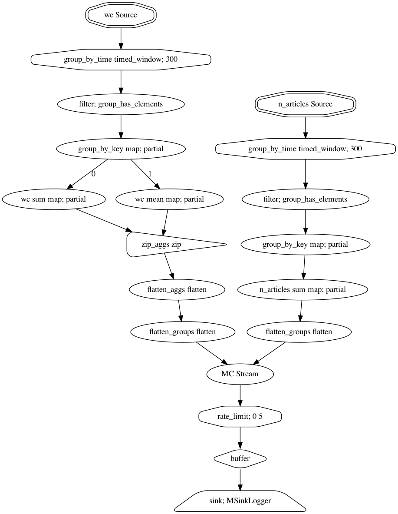

``metrix``
==========

``metrix`` is a Python library for tracking metrics through streams, with configurable
tagging, batching, aggregating, and outputting of individual elements. It's designed
for handling multiple metrics collected individually at high rates with shared output
destinations, such as a log file and/or database, especially in the case that outputting
metrics is only required or desired at lower rates.

installation
------------

This package hasn't yet been published to PyPi (working on it...), but is still readily
installable via ``pip``:

.. code-block:: bash

   $ python -m pip install git+https://github.com/bdewilde/metrix.git#egg=metrix

As usual, this will also install direct dependencies -- ``streamz`` and ``toolz`` --
as well as a few other packages needed for them to work.

overview
--------

Users' entry into ``metrix`` is primarily through the :class:`MCoordinator <metrix.coordinator.MCoordinator>`
class. It coordinates the flow of metric elements through one or multiple streams into
one or multiple output destinations (called "sinks"), with an optional rate limit imposed
before each sink to avoid any problematic pileups.

Configuration is left up to users, since it's entirely dependent on specific contexts
and use cases. There are a few key considerations:

- the metrics to track: their names; any tags to apply to elements by default; how often
  to batch elements, either in time or number; and the aggregation(s) to be performed on
  batches of values
- what to do with the aggregated metrics: where results should go, and if they should
  be submitted at throttled rates

It's important to note that a single metric stream may output *multiple* aggregated
values per batch, since each unique (name, aggregation, tags) combination is grouped
together before sending them on to their destinations.

example
-------

Let's say we want to track the total number of articles published to a news site
in 5-minute tumbling windows, as well as the total and average word counts per batch.
We also want to tag articles by the section in which they're published, but this is
only needed for the total published counts. Lastly, we'd like to log the aggregated
results for diagnostic purposes.

How can we do this with ``metrix``?

.. code-block:: pycon

   >>> import logging, statistics
   >>> from metrix import MCoordinator, MStream, MSinkLogger
   >>> # configure MC with metric streams and sinks
   >>> mc = MCoordinator(
   ...     mstreams=[
   ...         MStream(
   ...             "n_articles",  # metric name
   ...             agg=sum,  # function to get the total number per batch
   ...             default_tags={"section": "NA"},  # default article tag, to avoid null values
   ...             window_size=300,  # aggregate every 300 seconds (5 minutes)
   ...         ),
   ...         MStream(
   ...             "wc",  # metric name (shorthand for "word count")
   ...             agg=[sum, statistics.mean],  # functions to get total and average values
   ...             window_size=300,  # same as n_articles, tho this isn't required
   ...         ),
   ...     ],
   ...     msinks=[
   ...         MSinkLogger(level=logging.INFO),  # log agg'd metrics at "info" level
   ...     ],
   ...     rate_limit=0.5,  # impose a half-second rate limit for [technical reason]
   ... )
   >>> # fake articles data (but let's pretend)
   >>> articles = [
   ...     {"text": "...", "section": "politics"},
   ...     {"text": "...", "section": "science"},
   ...     {"text": "..."},  # missing section!
   ...     ...
   ... ]
   >>> # send metric elements for each article into corresponding streams via the MC
   >>> for article in articles:
   ...     mc.send(
   ...         "n_articles",  # metric name
   ...         1,  # metric value, to be aggregated with other values
   ...         tags={"section": article["section"]} if article.get("section") else None,  # optional tags
   ...     )
   ...     mc.send("wc", len(article["text"].split()))
   >>> # five minutes later... (fake aggregated metrics data, but again, let's pretend)
   INFO:metrix.sinks:MElement(name='n_articles.sum', value=625, tags={'section': 'politics'})
   INFO:metrix.sinks:MElement(name='n_articles.sum', value=290, tags={'section': 'science'})
   INFO:metrix.sinks:MElement(name='n_articles.sum', value=35, tags={'section': 'NA'})
   INFO:metrix.sinks:MElement(name='wc.sum', value=161690, tags=None)
   INFO:metrix.sinks:MElement(name='wc.mean', value=170.2, tags=None)

With the optional ``networkx`` and ``graphviz`` dependencies installed, we can easily
visualize what the corresponding collection of metric streams and sinks looks like:

.. code-block:: pycon

   >>> mc.stream.visualize(filename=None)

performance
-----------

``metrix`` provides features and an API tailored to a particular use case -- "metrics
tracking through streams" -- but under the hood, ``streamz`` and ``toolz`` do the heavy
lifting. As such, this package's performance is largely dependent on theirs. According to
`the docs <https://streamz.readthedocs.io/en/latest/core.html#performance>`_, ``streamz``
adds microsecond overhead to typical Python operations.

In practical terms, ``metrix`` can process up to about 7500 metric elements per second
(not including any I/O costs associated with sinks, such as network connections or
disk writes). This throughput doesn't vary much by the complexity of the input or output
streams; it's dominated by the total number of messages sent in.

.. toctree::
   :maxdepth: 2
   :caption: API Reference:

   api_reference/coordinator
   api_reference/stream
   api_reference/sinks
   api_reference/element

indices and tables
------------------

* :ref:`genindex`
* :ref:`modindex`
* :ref:`search`
